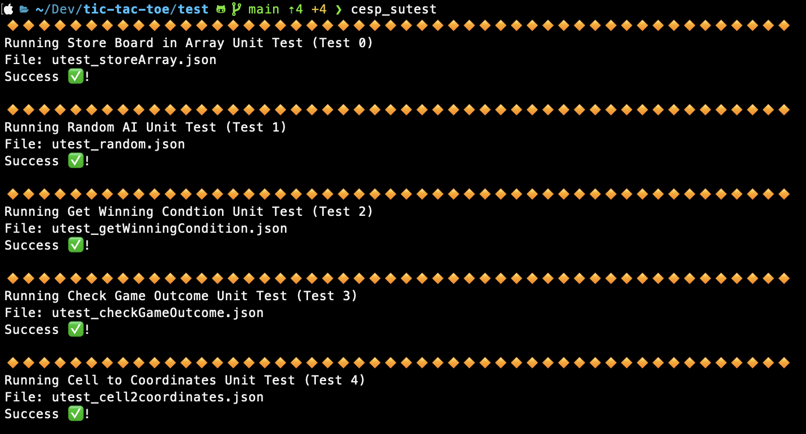

# CESP Tic-Tac-Toe

Simple Tic-Tac-Toe game with support for one and two players.

## Authors

- Philip Prüßner
- Victoria Strobel
- David Ullmer

## Description
### How to run
To start the game, open src/main.asm in [Rars](https://github.com/TheThirdOne/rars). Open the Bitmap display, set the pixel unit width and height to 2, the resolution to 512x512 and the Display Base Address to ox1004000 (Heap) and connect to programm. To interact with the game, follow the instructions in the Rars Run I/O console.

### 1 Player Mode
In 1 Player Mode, the player is always X and begins. After the player has entered a number, the computer chooses another unoccupied cell. This process repeats itself until a winner is determined or the game is tied.

### 2 Player Mode
In 2 Player Mode, the two Players X and O are entering their cell values one after the other. Player 1 (X) always begins.

## Files

`src/main.asm`: Main file of program

`src/draw/`: files for drawing things on the display

`src/libs/`: constant definitions for running the game in Rars.

`test/draw/`: unit tests for drawing things on screen

## Screenshots

## Test
Successful general unit tests:

Successful draw unit tests:
