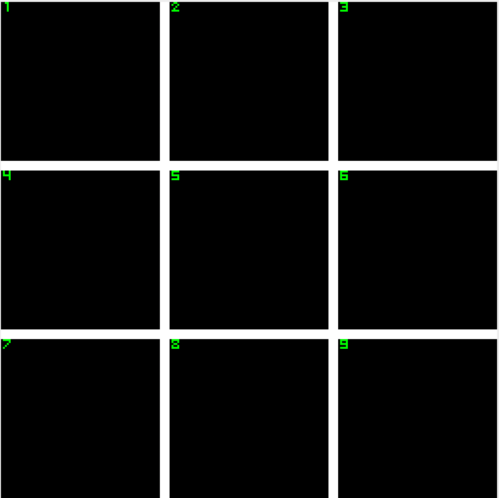

# Winning Conditions
There are 8 possible ways to win Tic-Tac-Toe. We assigned them numbers.
The cells are numbered in the follwing way:

| Condition | Cells with same symbol | Explaination |
|-----------|------------------------| ------------ |
| 1         | 1, 2, 3                | horizontal row 1 |
| 2         | 3, 5, 7                | diagonal bottom left to top right |
| 3         | 4, 5, 6                | horizontal row 2 |
| 4         | 1, 5, 9                | diagonal top left to bottom right |
| 5         | 3, 6, 9                | vertical column 3 |
| 6         | 1, 4, 7                | vertical column 1 |
| 7         | 2, 5, 8                | vertical column 2 |
| 8         | 7, 8, 9                | horizontal row 3 |

The numbers were chosen to make getting the winner from the array easy.

# AI
The one player mode uses a stupid AI which simply chooses a random cell using the Rars random syscall. If the cell is already occupied, the syscall is repeated until a not-occupied cell is found.

We didn't make the AI more intelligent, because the Tic Tac Toe is [is a solved game, with a forced draw assuming best play from both players](https://en.wikipedia.org/wiki/Tic-tac-toe) (the computer plays always at it's best --> the player can never win).